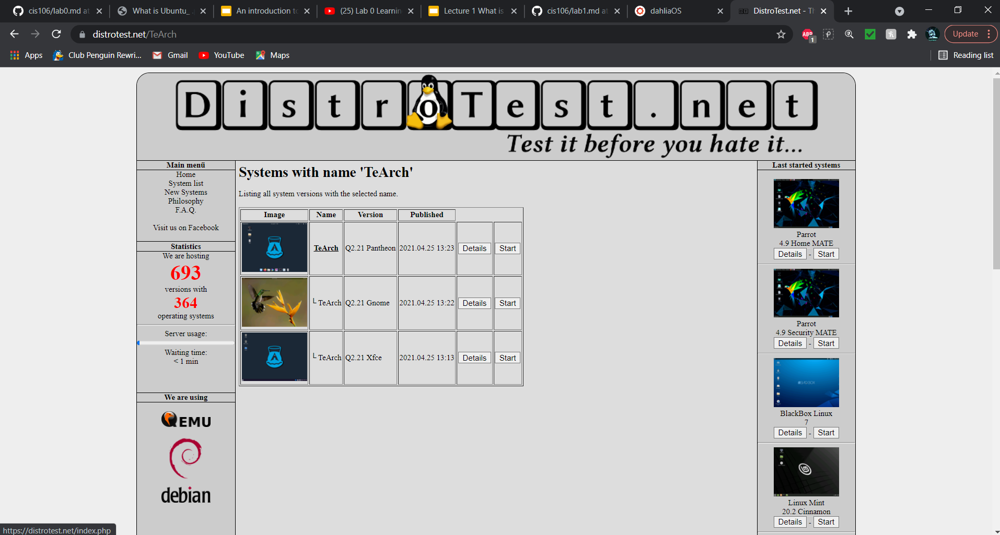
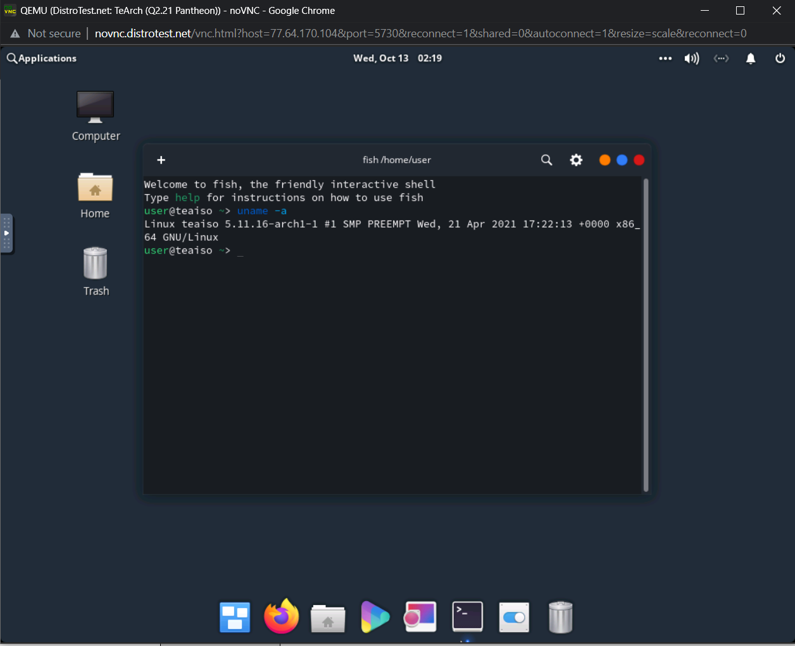

## Question 1
1. What is the OS Type:
   * **The OS type is Linux**
2. Which major distro is it based on?
   * **The major distro it is based on is Debian**
3. Which processor architecture does it support?
    * **It supports armfh, ppc64el, riscv, s390x, and x86_64**
4. Is the distribution active or is it discontinued? 
    * **The distribution status is Active**
5. What is Distro's home page?
    * **Distro's home page is (Ubuntu)[https://ubuntu.com]**

## Question 2
1. What is the name of the distribution and the OS Type
   * **Oracle Linux is the distribution & Linux is the OS**
2.  Which major distro is it based on?
    * **It is based on Red Hat**
3. Which processor architecture does it support?
    * **The processor architecture it supports is aarch64 and x86_64**
4. Is the distribution active or is it discontinued?
    * **The distribution is currently active**
5. What is the distro's home page?
    * **The distro's home page is (Oracle Linux)[https://www.oracle.com/linux]**
  
## Question 3
1. What is the name of the distribution?
    * **The name is Kali Linux**
2. What is the country of Origin?
    * **The country of origin is Switzerland**
3. What major distribution is it based on?
    * **It is based on Debian**
4. What is the distribution catagory?
    * **The distribution catagory is Data Rescue, Forensics, Live Medium, Raspberry Pi, Security**
5. Which processor architecture, aside from the one in the original query, does the OS support?
    * **It also supports armel & i686**

## Question 4
1. A Linux distribution used for Data Rescue/Data Recovery
* Distro Name: **Kaisen Linux**
* Website:**(Kaisen Linux)[https://kaisenlinux.org/]**
* Desktop Environment: **KDE Plasma, LXDE, MATE, Xfce**

2. A Linux distribution used for Education that supports the ix86 processor archictecture
* Distro Name: **ALT Linux**
* Website: **(ALT LINUX)[https://en.altlinux.org/]**
* Desktop Environment: **AfterStep, Blackbox, Cinnamon, Enlightenment, FVWM, GNOME, IceWM, KDE, LXDE, MATE, Openbox, LXQt, WMaker, Xfce**
3. A Linux distribution that supports the OEM installation method
* Distro Name: **Linux Mint**
* Website:**(Linux Mint)[https://linuxmint.com/]**
* Desktop Environment: **Cinnamon. MATE, Xfce**

## Question 5
**I was reading into what dahliaOS is and I find it quite interesting on how simplistic it appears. One of the main things I have noticed in the description is that it states that it's dual kernal approach can allow users with newer hardware to take advantage of the Zircon Kernal while maintaining support for older devices using the old Linux Kernal. I believe it can be useful to utilize in interchangable devices. This distribution also holds other special features like Internet Recovery, which is if something were to go wrong with the OS it will automatically download and boot from the last image it was on. I find that feature useful and doesn't always appear with other OS. It also explains how easy multitasking can be. There is also something called containers in which allow you to transfer older apps into this new OS without issue as long as they are from the containers.**

## Question 6
DistroTest.net is a project that allows you to test Linux/BSD distributions on your web browser. This website is great for trying out distributions before you even download the ISO file. Go to Distrotest.net and click on any of the distributions. Start the distribution and take a screenshot of the browser window that just popped up.

Locate the terminal application in the distribution you started and type the following command: uname -a Take a screenshot of the browser window showing the terminal application open.

Stop the machine and take a screenshot of the browser window showing that the machine has been stopped.

